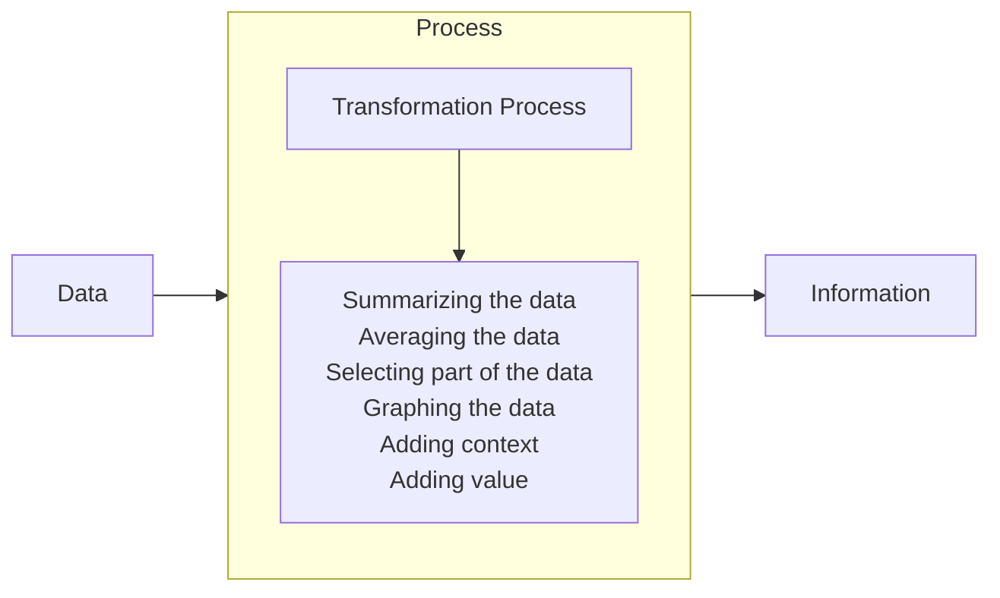
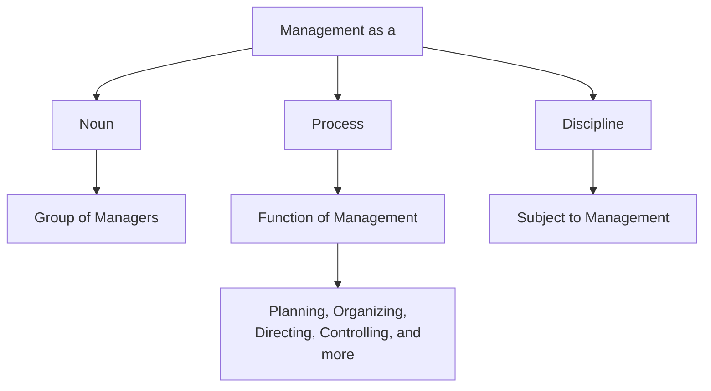
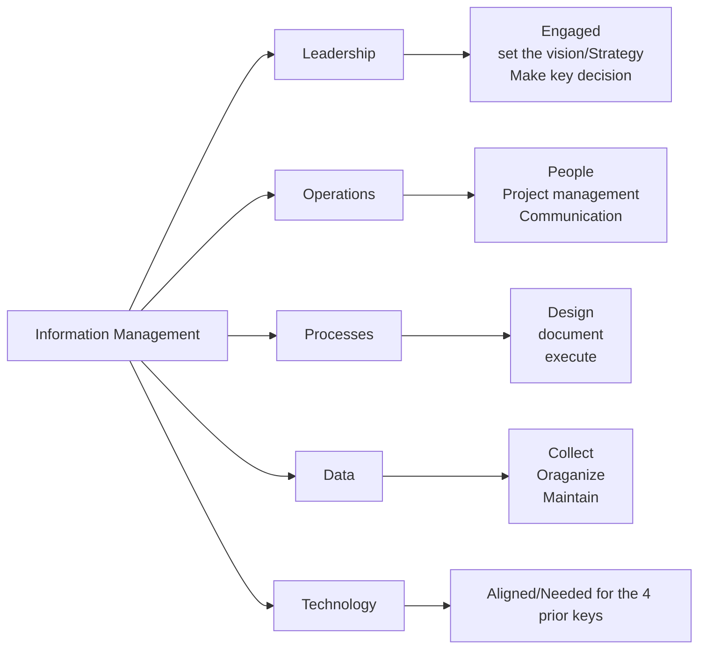

## Key Points
- What is Data and Information?
- Transformation of Data into Information using a Data Process
- The Origins of Information Management
- What is Management?
- What is Information Management?
- Why is Information Management Important?
- Five keys to Information Management

## Data

Information in raw or unorganized forms ( such as alphabets, numbers, or symbols) that refer to, or represent, conditions, ideas, or objects. Data is limitless and present everywhere in the universe.

Most data is being converted into a digital format:
- Driven by user demand
- Facilitated by:
	- Increase in data processing capabilities
	- Lower cost and increased speed of storage
	- Affordable and faster Network

#### Who creates data?
- Individuals
- Businesses

### Categories of Data
It can be structure or unstructured form
- Structured
	- Data Bases
	- Spread Sheets
- Unstructured
	- Forms
	- Images
	- Audio
	- Movies
> Over 80% of information/data is unstructured

![[Pasted image 20221109141147.png]]

## Information
The organized form of data

### Definitions
- Data have been processed to be meaningful
- Data have been processed for a purpose
- Data have been interpreted and understood by the recipient

## Transformation of Data -> Information

## Information Management
- Application of Management techniques to collect information, communicate  it within and outside the organization, and process it to enable managers to  make quicker and better decisions.

## Origins
#### 1970
- Largely limited for files, file maintenance, and life cycle management of paper-based-files, other media and records.
- All paper-based
#### 1990
- When information was regularly  disseminated across computer networks and by other electronic means,  network managers, in a sense, became information managers.
- Electronic and digital means.

### Management

#### According to Theo Heimann

- An individual or group that accept responsibilities to run an organization. They Plan, Organize, Direct and Control all the essential activities of the organization. Management does not do the work themselves. They motivate others to do the work and co-ordinate (i.e. bring together) all the work for achieving the objectives of the organization.

##### Management brings the 6 M's
- Men and Women
- Money
- Machine
- Materials
- Methods
- Markets

### Why it is Important
- Increased knowledge
- Decrease inefficiency
- Better creation and implementation of action plans to address areas of opportunity.
##### Managing information
- Saves you money
- Makes you money
- Keeps you out of trouble.

![[Pasted image 20221109171201.png]]

### Five keys

