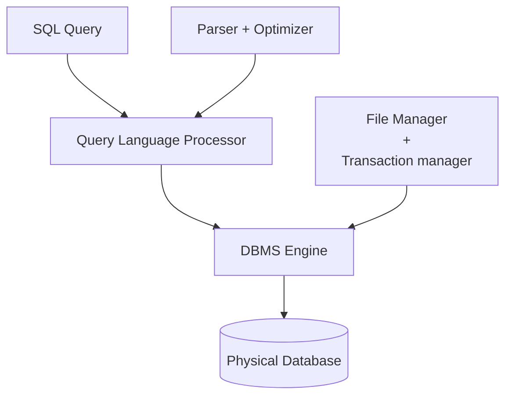

or **SQL** is a programming language was first developed in the 1970's.
- By IBM researchers **Raymond Boyce** and **Donald Chamberlin**.
- The programming language called "SEQUEL", was published in the book of Edgar Frank Todd's paper "**A Relational Model of Data for Large Shared Data Banks**" in 1970
### History
- **1970** - Dr. E. F. "Ted" of IBM is known as the father of relational databases. He described a relational model for databases.
- **1974** - Structured Query Language appeared
- **1978** - IBM worked to develop Codd's ideas and released a product named **System R**
- **1986** - IBM developed the first prototype of relational database and standardized by ANSI.
- First relational database was release by **Relational Software** later becoming **Oracle**.

## What really is it?
- SQL is Structured Query Language, which is a computer language for storing, manipulating and retrieving data stored in relational database.
- SQL is the standard language for Relation Database System.
	- All relational database management systems like MySQL, MS Access, Oracle, Sybase, Informix, postgres and SQL Server use SQL as standard database language.

## Why SQL?
It allows users to
- Access data in relational database management systems (RDMS).
- Describe the [[2nd Year/(DCIT 24) Information Management/Introduction#Data|data]].
- [[Structured Query Language#DML - Data Manipulation Language|Define the data in database and manipulate]] it.
- Embed within other languages using SQL modules, libraries & pre-compilers.
	- Used to be manipulated by other languages like Java or Python.
- [[Structured Query Language#DDL - Data Definition Language|Create and drop databases and tables]].
- Create view, stored procedure, functions in a database.
- [[Structured Query Language#DCL – Data Control Language| Set permissions]] on tables, procedures, and views.

## Process




## Commands
### DDL - Data Definition Language
|Command| Description|
|---|---|
|CREATE | Create new table, a view of a table, or other object in database.|
|ALTER | Modifies an existing database object, such as a table.|
|DROP| Deletes an entire table, a view of a table or other object in the database.|

### DML - Data Manipulation Language
|Command | Description|
|---|---|
|INSERT| Creates a record|
|UPDATE| Modifies records|
|DELETE | Deletes records|

### DCL – Data Control Language
|Command | Description|
|---|---|
| GRANT | Gives a privilege to user|
| REVOKE | Takes back privileges granted from usedr.|

### DQL - Data Query Language
|Command | Description|
|---| ---|
|SELECT | Retrieves certain records from one or more tables|


## Syntax Commands
> Keywords in SQL aren't case-sensitive so `create` will be the same as `CREATE`

CREATE DATABASE:
```SQL
CREATE  DATABASE database_name ;
```

USE STATEMENT:
```SQL
USE database-name;
```


SHOW STATEMENT:
```SQL
SHOW databases;
```


CREATE TABLE:
```SQL
CREATE TABLE table_name(

       column-name1 datatype, 

       column –name2 datatype;

      etc,)
```

SQL DESC Statement:
```SQL
DESC table_name;
```
```SQL
DESCRIBE  table-name;
```


DROP DATABASE  STATEMENT:
```SQL
DROP DATABASE database_name;
```

DROP TABLE STATEMENT:
```SQL
DROP  TABLE  table_name;
```

**ALTER TABLE STATEMENT:**
```SQL
ALTER TABLE table_name {ADD|DROP|MODIFY} column_name {data_type};
```
```SQL
ALTER TABLE table_name RENAME TO new_table_name
```

**DELETE STATEMENT:**
```SQL
DELETE FROM table_name  WHERE (CONDITION);
```

**SQL UPDATE STATEMENT:**
```SQL
UPDATE table_name   SET column1 = value1, column2 = value2……..
     column N=valueN   WHERE  (CONDITION);
```

    
**SQL INSERT INTO Statement:**
```SQL
INSERT INTO table_name( column1, column2....columnN) VALUES ( value1, value2....valueN);
```
```SQL
INSERT INTO table_name  VALUES ( value1, value2....valueN);
```

Example:
```SQL
INSERT INTO us_states VALUES (1, "California", "California Poppy");
```

**SQL SELECT Statement:**
```SQL
SELECT column1, column2....columnN   FROM table_name;
```
```SQL
SELECT * FROM table_name
```

**SQL WHERE Clause:**
```SQL
SELECT column1, column2....columnN FROM table_name WHERE CONDITION;
```

**SQL UPDATE STATEMENT:**
```SQL
UPDATE table_name   SET column1 = value1, column2 = value2……..

INSERT INTO table_name( column1, column2....columnN) VALUES ( value1, value2....valueN);column N=valueN   WHERE  (CONDITION) ;
```
Example
```SQL
INSERT INTO us_states (name, flower) VALUES ("Alaska", "Forget-me-not");
INSERT INTO us_states (name) VALUES ("Hawaii");
```

**SQL INSERT INTO Statement:**
```SQL
INSERT INTO table_name( column1, column2....columnN) VALUES ( value1, value2....valueN);
```
```SQL
INSERT INTO table_name  VALUES ( value1, value2....valueN);
```


**SQL SELECT Statement:**
```SQL
SELECT column1, column2....columnN   FROM table_name;
```
```SQL
SELECT * FROM table_name
```

**SQL WHERE Clause:**
```SQL
SELECT column1, column2....columnN FROM table_name WHERE CONDITION;
```
Example
```SQL
SELECT * FROM fruits WHERE season = "summer";

SELECT name, price FROM fruits WHERE season = "winter" 
```


**SQL AND/OR Clause:**
```SQL
SELECT column1, column2....columnN FROM table_name
WHERE CONDITION-1 {AND|OR} CONDITION-2;
```
Example
```SQL
SELECT * FROM fruits WHERE price < 4 AND season = "summer";

SELECT name, price FROM fruits WHERE season = "summer" OR season="winter";
```

#### SQL Command Connections
|**SYNTAX USE**| **Database and Other Database related objects**| **Data and Records**|
|---|---|---|
|Create New| **CREATE**| **INSERT**|
|Modify/ Change| **ALTER**| **UPDATE**|
|Delete/ Remove|**DROP**|**DELETE**|
|Retrieves information|**DESCRIBE**|**SELECT**|
|Displays Errors, Lists, View, etc.|**SHOW**|---|
|Select object to USE |**USE**|---|


