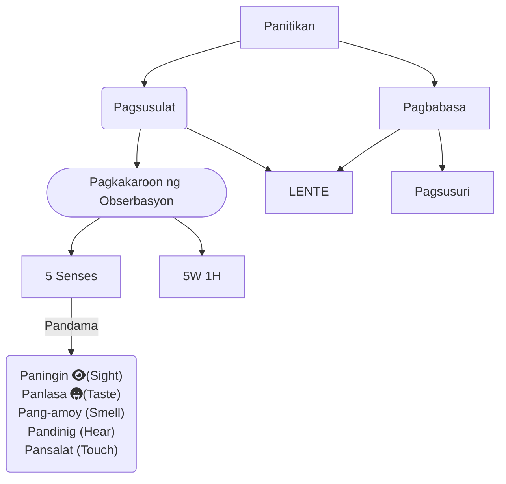

#inProgress 

### Tatlong Bagay
- Magbasa
	- Articles (babasahin)
	- May-akda
- Paglikha
	- Paggawa ng sariling sanaysay/akda
- Pagsusuri
	- Pinakamataas na gawain sa panitikan
	- Paglalarawan ng kritiko at paraan sa isang akda.

## Mga babasahin
### Lumbera - Pambansang Panitikan at ang Bago
- **Kanon**
	- Panitikang Pandaigdig - Nababasa ng buong daigdig
- Modernong Panitikan
- Klasiko - Panitikang Popular

### Soledad, Reyes 
- Buhay pa
#### Pormalismo
- Porma - May ganda at pakinabang
	- "May ganda" - For the arts sake
	- "Pakinabang" - Relevance
- Pagkakaroon ng
	- Kahalagahan
	- Praktika

#### Istrukturalismo

#### Marxismo

#### Feminismo

#### Pagtuturo ng Panitikang Pilipino

### Torres-Yu at Tolentino - Pagbabalangkas
- Awtline (outline)
	- Bago 
	- Eksperimentalidad
	- Sektoral
	- Rehiyunal
- Bunga ang panitikan base sa:
	- Mga pinakita sa babasahin (di ko na alam)

### San Juan - Semiotika
- Akda sa Isang Salita
	- Paghahanap ng pakahulugan ng akda sa isang salita
		- Gamit ng mga Signos
- Semiotika
	- Linguistic signos
	- Visual signos
- Panitikan para sa lahat - maiintindihan ng lahat
- Bisa ng panitikan

## Proseso ng Pagbabasa
### Skimming
- Pagbabasa ng mahalagang parte
	- Title
	- Subtitle (subheading)
- Pagkuha ng general o main na ideya

### Scanning
- Pagbabasa ng parte-parte
- Patalun-talon na klase ng basa

### Pasalita
- Pagbabasa ng Maingay

### Tahimik
- Pagbabasa sa mata
- Titignan lamang ang mga salita

## Dapat Pansinin - Things that are
- **Emphasize** - Pinakamahalaga
- **Related** - Pag-uugnay ng mga bagay
- **Repeated** - Umuulit na mga salita sa akda
- **False** - Kontradiksyon na pruweba
- **True** - Konsepto ng katotohanan

